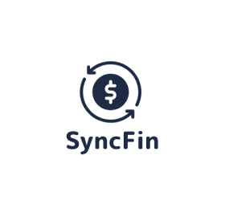

<p align="center">
  
</p>

<h1 align="center">SyncFin</h1>

<p align="center">
  Aplicação web de controle financeiro pessoal — cadastro de usuários, contas bancárias, receitas, despesas e investimentos.
</p>

<p align="center">
  
  
  
  
</p>

---

## Sobre o projeto

O **SyncFin** é uma aplicação web desenvolvida em Java para o curso de Análise e Desenvolvimento de Sistemas (FIAP), como projeto integrador ao longo de todas as fases do curso — desde a concepção (Visão do Produto e Story Mapping), passando pelo protótipo (Figma) e modelagem de dados (Oracle SQL Developer Data Modeler), até a implementação completa do back-end e front-end.

A proposta é permitir que o usuário centralize sua vida financeira: cadastre-se, vincule uma conta bancária e acompanhe receitas, despesas e investimentos em um único painel.

## Funcionalidades

- **Autenticação** — login/logout com sessão de usuário e senha armazenada com hash (`CriptografiaUtils`).
- **Controle de acesso** — `LoginFilter` bloqueia o acesso a páginas internas para usuários não autenticados.
- **Cadastro de cliente** — criação, edição e inativação de conta (soft delete via status).
- **Conta bancária** — vínculo de uma conta bancária ao cliente autenticado.
- **Receitas** — CRUD de receitas do usuário, sempre validado por posse (ownership) do registro.
- **Despesas** — CRUD de despesas do usuário, com a mesma validação de posse.
- **Investimentos** — CRUD de investimentos do usuário.
- **Dashboard** — página inicial com resumo consolidado das informações financeiras do cliente logado.

## Arquitetura

O projeto segue uma arquitetura em camadas, próxima de um MVC clássico com Servlets:

```
Servlet (controller)  →  DAO  →  Oracle Database
        ↓
      JSP (view)
```

- **`controller`** — Servlets responsáveis por receber requisições HTTP e orquestrar a chamada aos DAOs (`LoginServlet`, `CadastroServelet`, `ContaBancariaServlet`, `ReceitaServlet`, `DespesaServlet`, `InvestimentoServlet`, `HomeServlet`).
- **`dao`** — Acesso a dados via JDBC, com `BaseDao` centralizando a abertura/fechamento de conexão (`AutoCloseable` + try-with-resources).
- **`factory`** — `ConnectionFactory` monta a conexão JDBC a partir de variáveis de ambiente (nenhuma credencial fica no código-fonte).
- **`model`** — Entidades de domínio (`Cadastro`, `ContaBancaria`, `Receita`, `Despesa`, `Investimento`, `Transacao`, `Endereco`).
- **`filter`** — `LoginFilter` protege as rotas internas da aplicação.
- **`exception`** — Exceções de negócio (`EntidadeNaoEncontradaException`).
- **`util`** — Utilitários (`CriptografiaUtils` para hash de senha).
- **`webapp`** — Páginas JSP e assets estáticos (Bootstrap 5).

## Tecnologias

- Java 17
- Jakarta Servlet / JSP / JSTL
- Maven (empacotamento `war`)
- Oracle Database (JDBC via `ojdbc11`)
- Jakarta Mail (Angus Mail)
- Bootstrap 5

## Como executar localmente

### Pré-requisitos

- JDK 17+
- Maven 3.9+
- Um servidor de aplicação compatível com Servlet 6 / Jakarta EE 10 (ex.: Apache Tomcat 10+)
- Acesso a uma instância Oracle Database

### Configuração

O projeto lê as credenciais do banco a partir de variáveis de ambiente — **nenhuma credencial fica no repositório**.

1. Copie o arquivo de exemplo:

   ```bash
   cp .env.example .env
   ```

2. Preencha `.env` com os dados da sua instância Oracle:

   ```
   DB_URL=jdbc:oracle:thin:@host:1521:orcl
   DB_USER=SEU_USUARIO
   DB_PASSWORD=SUA_SENHA
   ```

3. Exporte as variáveis no ambiente onde o servidor de aplicação for iniciado (ou configure-as na sua IDE / no `setenv.sh` do Tomcat), já que a aplicação as lê via `System.getenv(...)`.

### Build e execução

```bash
mvn clean package
```

O artefato gerado em `target/syncFin.war` pode ser implantado em qualquer servidor Jakarta EE (Tomcat, por exemplo, copiando o `.war` para a pasta `webapps`).

## Estrutura do banco de dados

O modelo de dados (lógico e físico) foi desenvolvido no Oracle SQL Developer Data Modeler ao longo da Fase 3 do curso, contemplando as entidades de cliente, conta bancária, receitas, despesas e investimentos, com as respectivas normalizações.

## Status do projeto

Projeto entregue como Trabalho de Conclusão do curso de ADS (FIAP) e em evolução contínua — o histórico de commits documenta refatorações incrementais como padronização do fechamento de conexões (try-with-resources), validação de posse (ownership) nos DAOs e ajustes de autenticação/sessão.

## Autor

Desenvolvido por [Isabella do Carmo Brito](https://github.com/bellacarmobrito).
