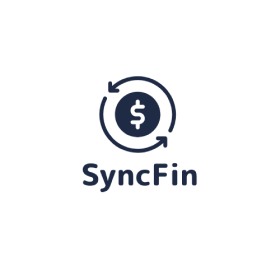

<p align="center">
  
</p>

<h1 align="center">SyncFin</h1>

<p align="center">
  Aplicação web de controle financeiro pessoal — cadastro de usuários, contas bancárias, receitas, despesas e investimentos.
</p>

<p align="center">
  
  
  
  
</p>

---

## Sobre o projeto

O **SyncFin** é uma aplicação web desenvolvida em Java para o curso de Análise e Desenvolvimento de Sistemas (FIAP), como projeto integrador ao longo de todas as fases do curso — desde a concepção (Visão do Produto e Story Mapping), passando pelo protótipo (Figma) e modelagem de dados (Oracle SQL Developer Data Modeler), até a implementação completa do back-end e front-end.

A proposta é permitir que o usuário centralize sua vida financeira: cadastre-se, vincule uma conta bancária e acompanhe receitas, despesas e investimentos em um único painel.

## Demonstração pública

🔗 **[syncfin.onrender.com](https://syncfin.onrender.com/)**

Login de teste:

| Campo | Valor |
|---|---|
| E-mail | `demo@syncfin.app` |
| Senha  | `DemoSync2026!` |

A conta demo já vem com contas bancárias, receitas, despesas e investimentos cadastrados, para dar para explorar o app sem precisar montar dados do zero. Ela é protegida no código (`CadastroServelet`) contra troca de e-mail/senha e contra exclusão, para continuar disponível para o próximo visitante — se você quiser testar essas ações mesmo assim, crie sua própria conta pelo "Cadastre-se".

> **Aviso:** a aplicação (Render) e o banco (Neon) usam planos gratuitos, que "dormem" após um tempo sem uso. A primeira requisição depois disso pode demorar até uns 50 segundos para responder — não é travamento, é só o ambiente acordando.

## Funcionalidades

- **Autenticação** — login/logout com sessão de usuário e senha armazenada com hash (`CriptografiaUtils`), sem persistir tela protegida em cache do navegador após o logout.
- **Controle de acesso** — `LoginFilter` bloqueia o acesso a páginas internas para usuários não autenticados.
- **Cadastro de cliente** — criação, edição e inativação de conta (soft delete via status), com endereço opcional e preenchimento automático a partir do CEP (API pública [ViaCEP](https://viacep.com.br/)).
- **Conta bancária** — vínculo de uma ou mais contas bancárias ao cliente autenticado, com sugestão de instituição bancária (nome, código e logo) via [Brasil API](https://brasilapi.com.br/).
- **Receitas** — CRUD de receitas do usuário, sempre validado por posse (ownership) do registro.
- **Despesas** — CRUD de despesas do usuário, com a mesma validação de posse.
- **Investimentos** — CRUD de investimentos, com painel de indicadores econômicos (Selic, CDI, IPCA via Brasil API) e estimativa de rendimento bruto até o vencimento (juros compostos, calculada no navegador).
- **Dashboard** — página inicial com resumo consolidado das informações financeiras do cliente logado.

## Arquitetura

O projeto segue uma arquitetura em camadas, próxima de um MVC clássico com Servlets:

```
Servlet (controller)  →  DAO  →  PostgreSQL Database
        ↓
      JSP (view)
```

- **`controller`** — Servlets responsáveis por receber requisições HTTP e orquestrar a chamada aos DAOs (`LoginServlet`, `CadastroServelet`, `ContaBancariaServlet`, `ReceitaServlet`, `DespesaServlet`, `InvestimentoServlet`, `HomeServlet`).
- **`dao`** — Acesso a dados via JDBC, com `BaseDao` centralizando a abertura/fechamento de conexão (`AutoCloseable` + try-with-resources).
- **`factory`** — `ConnectionFactory` monta a conexão JDBC a partir de variáveis de ambiente (nenhuma credencial fica no código-fonte).
- **`model`** — Entidades de domínio (`Cadastro`, `ContaBancaria`, `Receita`, `Despesa`, `Investimento`, `Transacao`, `Endereco`).
- **`filter`** — `LoginFilter` protege as rotas internas da aplicação.
- **`exception`** — Exceções de negócio (`EntidadeNaoEncontradaException`).
- **`util`** — Utilitários (`CriptografiaUtils` para hash de senha, `CpfUtils` para validação de CPF, `ValidationUtils` e `SessionUtils` de apoio aos Servlets).
- **`webapp`** — Páginas JSP e assets estáticos (Bootstrap 5).

## Tecnologias

- Java 17
- Jakarta Servlet / JSP / JSTL
- Maven (empacotamento `war`)
- PostgreSQL (JDBC via `org.postgresql:postgresql`)
- BCrypt (`org.mindrot:jbcrypt`) para hash de senha
- Bootstrap 5
- Docker / Docker Compose (build multi-stage com Maven + Tomcat, ambiente de desenvolvimento local)

## Integrações externas

Consumidas direto do navegador, em JavaScript puro (módulos ES), sem passar pelo back-end — se alguma delas estiver fora do ar, o formulário continua funcionando normalmente, só sem o preenchimento automático:

- **[ViaCEP](https://viacep.com.br/)** — autopreenchimento de endereço a partir do CEP.
- **[Brasil API](https://brasilapi.com.br/)** — lista de bancos (autocomplete e logo da instituição) e taxas de referência (Selic, CDI, IPCA) nas telas de investimento.

## Como executar localmente

### Opção mais simples: Docker Compose

Com Docker instalado, um único comando sobe a aplicação **e** o banco Postgres juntos, já com o schema pronto para você aplicar:

```bash
docker compose up --build
```

A aplicação fica disponível em `http://localhost:8080/`. Depois de subir, aplique o schema (uma vez só; veja o passo 4 da seção abaixo) e, se quiser dados de exemplo para navegar pelo app, rode também o [`db/seed-demo.sql`](db/seed-demo.sql):

```bash
docker compose exec -T db psql -U syncfin -d syncfin -f db/schema-postgres.sql
docker compose exec -T db psql -U syncfin -d syncfin < db/seed-demo.sql
```

### Opção manual (Tomcat + Maven)

#### Pré-requisitos

- JDK 17+
- Maven 3.9+
- Um servidor de aplicação compatível com Servlet 6 / Jakarta EE 10 (ex.: Apache Tomcat 10+)
- Acesso a uma instância PostgreSQL (local, ou remota — ex.: [Neon](https://neon.tech/), Azure Database for PostgreSQL Flexible Server)

#### Configuração

O projeto lê as credenciais do banco a partir de variáveis de ambiente — **nenhuma credencial fica no repositório**.

1. Copie o arquivo de exemplo:

   ```bash
   cp .env.example .env
   ```

2. Preencha `.env` com os dados da sua instância PostgreSQL. Para desenvolvimento local com Docker:

   ```
   DB_URL=jdbc:postgresql://localhost:5432/syncfin
   DB_USER=syncfin
   DB_PASSWORD=syncfin
   ```

   Para uma instância remota (ex.: Neon, Azure Database for PostgreSQL Flexible Server), é necessário anexar `?sslmode=require` à URL:

   ```
   DB_URL=jdbc:postgresql://<servidor>.postgres.database.azure.com:5432/syncfin?sslmode=require
   DB_USER=<usuario>
   DB_PASSWORD=<senha>
   ```

3. Exporte as variáveis no ambiente onde o servidor de aplicação for iniciado (ou configure-as na sua IDE / no `setenv.sh` do Tomcat), já que a aplicação as lê via `System.getenv(...)`.
4. Crie o schema executando `db/schema-postgres.sql` na sua instância (por exemplo: `psql "$DB_URL" -f db/schema-postgres.sql`, ajustando usuário/senha conforme necessário).

#### Build e execução

```bash
mvn clean package
```

O artefato gerado em `target/syncFin.war` pode ser implantado em qualquer servidor Jakarta EE (Tomcat, por exemplo, copiando o `.war` para a pasta `webapps`).

## Estrutura do banco de dados

O modelo de dados (lógico e físico) foi originalmente desenhado no Oracle SQL Developer Data Modeler ao longo da Fase 3 do curso, contemplando as entidades de cliente, conta bancária, receitas, despesas e investimentos, com as respectivas normalizações. O schema ativo do projeto hoje é PostgreSQL, evoluído a partir desse modelo, e está versionado em [`db/schema-postgres.sql`](db/schema-postgres.sql). Dados de exemplo para explorar a aplicação (a mesma conta usada na demonstração pública) estão em [`db/seed-demo.sql`](db/seed-demo.sql) — o script é idempotente, pode ser executado de novo a qualquer momento para "resetar" essa conta.

## Limitações conhecidas

- **Sem proteção CSRF.** Os formulários que alteram dado (cadastro, edição, exclusão) não carregam token anti-CSRF, então uma requisição forjada por um site externo poderia, em tese, ser executada em nome de um usuário autenticado enquanto sua sessão estiver ativa. Mitigar isso de forma consistente exigiria introduzir geração/validação de token de sessão em todos os formulários e Servlets que fazem `POST` — uma mudança arquitetural mais ampla do que as demais correções deste projeto, por isso foi conscientemente adiada em vez de resolvida parcialmente.

## Autor

Desenvolvido por [Isabella Brito](https://github.com/bellacarmobrito).
